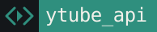

# Nub Coders

Engineering studio building production cloud infrastructure, self-hosted developer platforms, and open-source tools.

🌐 [nubcoders.com](https://nubcoders.com) &nbsp;·&nbsp; ✉️ [dev@nubcoders.com](mailto:dev@nubcoders.com) &nbsp;·&nbsp; 💬 [Telegram](https://t.me/nub_coder_s) &nbsp;·&nbsp; ▶️ [YouTube](https://youtube.com/@nub-coders) &nbsp;·&nbsp; 🐙 [GitHub](https://github.com/nub-coders)

---

## Live Platforms & Products

-  — application deployment platform with GitHub integration, live container management, and a terminal-style UI. *TypeScript · Docker · Node.js · React*
-  — self-hosted email platform with API-based sending, IMAP/SMTP/POP3, and automated wildcard SSL via DNS-01. *Docker · Nginx · SMTP*
-  — high-performance media-extraction API with token auth, rate limiting, and containerized nginx/SSL automation. *Python · yt-dlp · Docker*

## Open Source Projects

- [**Kurigram**](https://github.com/nub-coders/kurigram) — actively maintained Pyrogram fork with support for Gifts, Stories, Topics, business features and the latest Telegram updates. *Python · Telegram*
-  — open-source Telegram voice-chat music bot with queue management and streaming. *Python · Pyrogram · pytgcalls*

## Tech We Build With

  
  
  
  
  
  
  
  
  
  
  

---

<!-- GITHUB_STATS_START -->
<!-- GITHUB_STATS_END -->
